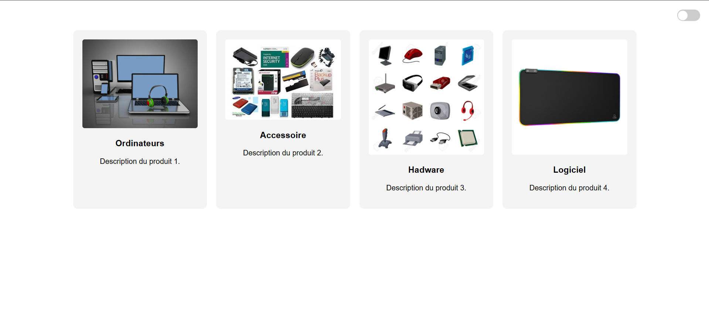
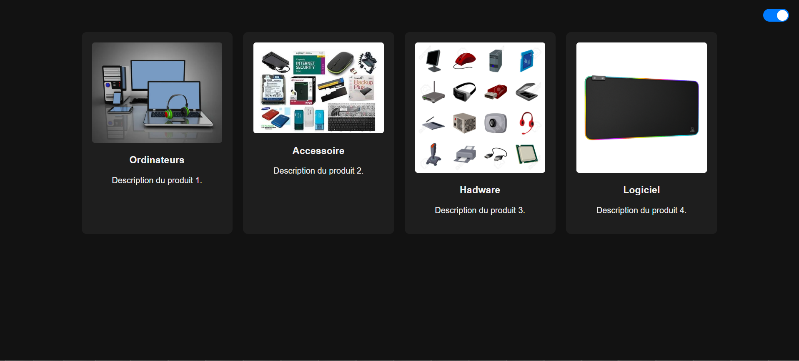

## 🛠 Instructions pour utiliser le projet

1. **Génération du code :**  
   Utilisez ChatGPT ou DeepSeek pour demander :  
   > « Créez une galerie de produits à 3 cartes avec des effets de survol, une bascule de thème (clair/foncé) et des animations en fondu à l'aide de HTML/CSS/JS. »  

2. **Édition locale :**  
   Collez le code généré dans **Replit** ou dans votre **éditeur local** (VS Code, Sublime, etc.).

3. **Test et amélioration :**  
   - Vérifiez que la **bascule de thème** fonctionne correctement.  
   - Testez les **animations et effets de survol**.  
   - Appliquez des améliorations suggérées par l’IA si nécessaire.

4. **Publication :**  
   - Envoyez le code final sur **GitHub**.  
   - Partagez le lien vers le dépôt pour que d’autres puissent consulter et tester votre galerie.

---

## 📌 Fonctionnalités principales

- **3 cartes de produits** interactives  
- **Mode clair / sombre** basculable avec un bouton  
- **Animations en fondu** pour l’affichage des cartes et des interactions  
- **Effets visuels au survol** pour chaque carte
## 📂 Structure du projet

personal-intro-webpage
├── css
│ └── style.css
├── js
│ └── script.js
├── index.html
└── README.md

## 🖼️ Captures d’écran du projet

### 1️⃣ Whith WhiteMode

### 2️⃣ Whith BlackMode

